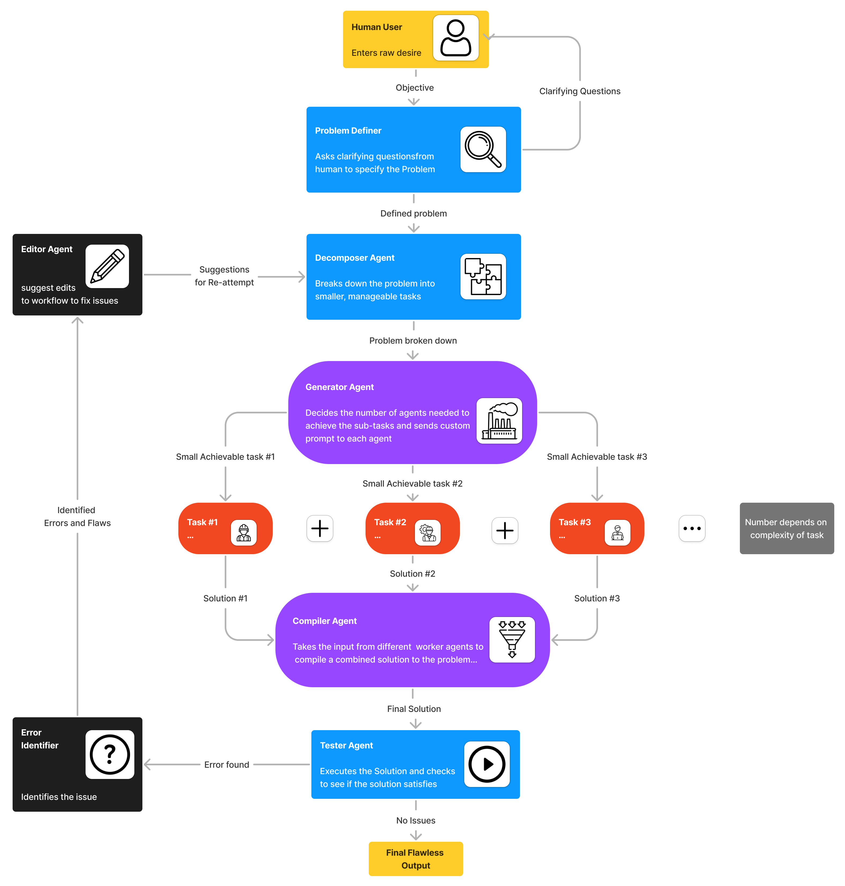

# Multi-Agent Architecture for Problem Solving

The Multi-Agent Architecture for Problem Solving is a sophisticated system that employs a systematic approach to tackle complex problems by integrating specialized modules called agents. This architecture ensures that every aspect of a given problem is addressed through the collaboration of these agents, offering comprehensive and effective solutions.

## Key Features

- **Modular Design**: The architecture consists of multiple specialized agents, each designed to handle specific tasks, allowing for a divide-and-conquer approach to problem-solving.
- **Iterative Process**: The agents work together in an iterative manner, refining and improving the solution until it meets the original objectives, ensuring high-quality results.
- **Specialization**: Each agent is trained to excel in its designated task, whether it's problem definition, decomposition, generation, execution, testing, or editing, enabling efficient and accurate problem-solving.
- **Collaborative Approach**: The agents communicate and collaborate with each other seamlessly, sharing information and building upon each other's work to arrive at the best possible solution.

## System Workflow

1. **Problem Definer Agent**:
   - Clarifies the user's objectives through iterative questioning.
   - Ensures a clear understanding of the problem before passing it to the Decomposer Agent.

2. **Decomposer Agent**:
   - Breaks down the problem into manageable subtasks.
   - Explores alternative approaches for each subtask.
   - Passes individual subtasks to the Generator Agent.

3. **Generator Agent**:
   - Determines the number of Worker Agents needed based on the subtasks.
   - Generates custom prompts specifying individual tasks for each Worker Agent.
   - Sends the output to the respective Worker Agents.

4. **Worker Agents**:
   - Specialized in solving specific subtasks, such as coding, analysis, data manipulation, etc.
   - Plan and explain their reasoning step by step.
   - Iterate on individual problems until correct solutions are found.

5. **Compiler Agent**:
   - Combines the solutions from Worker Agents into a unified final solution.
   - Evaluates and selects the most promising combined solution.

6. **Tester Agent**:
   - Executes and evaluates the final solution against the original problem objectives.
   - Provides detailed feedback on the strengths and weaknesses of the solution.

7. **Error Identifier Agent**:
   - Identifies issues or flaws in the solution based on the Tester's feedback.
   - Categorizes errors or flaws and prioritizes them based on their impact.

8. **Editor Agent**:
   - Suggests edits or improvements based on the identified errors.
   - Iterates the editing process based on the Tester's feedback.
   - Enhances workflow efficiency by refining the solution.

## Use Cases

The Multi-Agent Architecture for Problem Solving can be applied to a wide range of domains, including:

- **Software Development**: Automating code generation, testing, and debugging processes.
- **Data Analysis**: Extracting insights from complex datasets and generating meaningful reports.
- **Research and Development**: Conducting comprehensive literature reviews and generating innovative ideas.
- **Business Strategy**: Analyzing market trends, competitor analysis, and generating strategic recommendations.

## Getting Started

To get started with the Multi-Agent Architecture for Problem Solving, follow these steps:

1. Clone the repository: `git clone https://github.com/yourusername/multi-agent-architecture.git`
2. Install the required dependencies: `pip install -r requirements.txt`
3. Run the main script: `python main.py`
4. Input your problem statement and let the agents work their magic!

For detailed usage instructions and examples, please refer to the [documentation](docs/README.md).

## Contributing

We welcome contributions from the community! If you'd like to contribute to the Multi-Agent Architecture for Problem Solving, please follow the guidelines outlined in [CONTRIBUTING.md](CONTRIBUTING.md).

If you encounter any issues or have suggestions for improvements, please open an issue on the [GitHub repository](https://github.com/yourusername/multi-agent-architecture/issues).

## License

This project is licensed under the [MIT License](LICENSE).

---

By leveraging the power of the Multi-Agent Architecture for Problem Solving, you can tackle complex problems with ease and efficiency. Let the agents handle the heavy lifting while you focus on defining the problem and reaping the benefits of the comprehensive solutions they provide.

## Advantages

The Multi-Agent Architecture for Problem Solving offers several key advantages over traditional problem-solving approaches:

1. **Efficiency**: By breaking down problems into smaller subtasks and assigning them to specialized agents, the architecture enables parallel processing and reduces overall problem-solving time.

2. **Adaptability**: The modular design allows for easy integration of new agents or modification of existing ones, making the architecture highly adaptable to different problem domains and evolving requirements.

3. **Robustness**: The iterative process and collaboration between agents ensure that the final solution is thoroughly tested and refined, resulting in robust and reliable outcomes.

4. **Scalability**: The architecture can scale to handle problems of varying complexity and size by adjusting the number and specialization of agents involved in the problem-solving process.

5. **Continuous Improvement**: The feedback loop between the Tester and Editor agents enables continuous improvement of the solution, ensuring that it remains optimal and up-to-date.

## Future Enhancements

We are continuously working on enhancing the Multi-Agent Architecture for Problem Solving. Some planned future enhancements include:

- Integrating machine learning capabilities to enable agents to learn and adapt based on past problem-solving experiences.
- Developing a user-friendly interface for easier interaction with the system and visualization of the problem-solving process.
- Expanding the library of specialized agents to cover a wider range of problem domains and tasks.
- Optimizing the communication protocols between agents to further improve efficiency and reduce latency.

## Acknowledgements

We would like to express our gratitude to the following individuals and organizations for their contributions and support:

- [Contributor 1](https://github.com/contributor1) for their valuable insights and code contributions.
- [Organization X](https://organizationx.com) for providing the initial funding and resources for this project.
- The open-source community for their continuous support and inspiration.

## Contact

If you have any questions, suggestions, or collaboration opportunities, please feel free to reach out to us:

- Email: contact@multiagenthub.com
- Twitter: [@MultiAgentHub](https://twitter.com/MultiAgentHub)
- LinkedIn: [Multi-Agent Architecture for Problem Solving](https://www.linkedin.com/company/multi-agent-architecture)

We look forward to hearing from you and working together to push the boundaries of problem-solving with the Multi-Agent Architecture!

---

With the Multi-Agent Architecture for Problem Solving, you can harness the power of collaboration, specialization, and iteration to solve even the most complex problems. Join us on this exciting journey and experience the future of problem-solving today!
